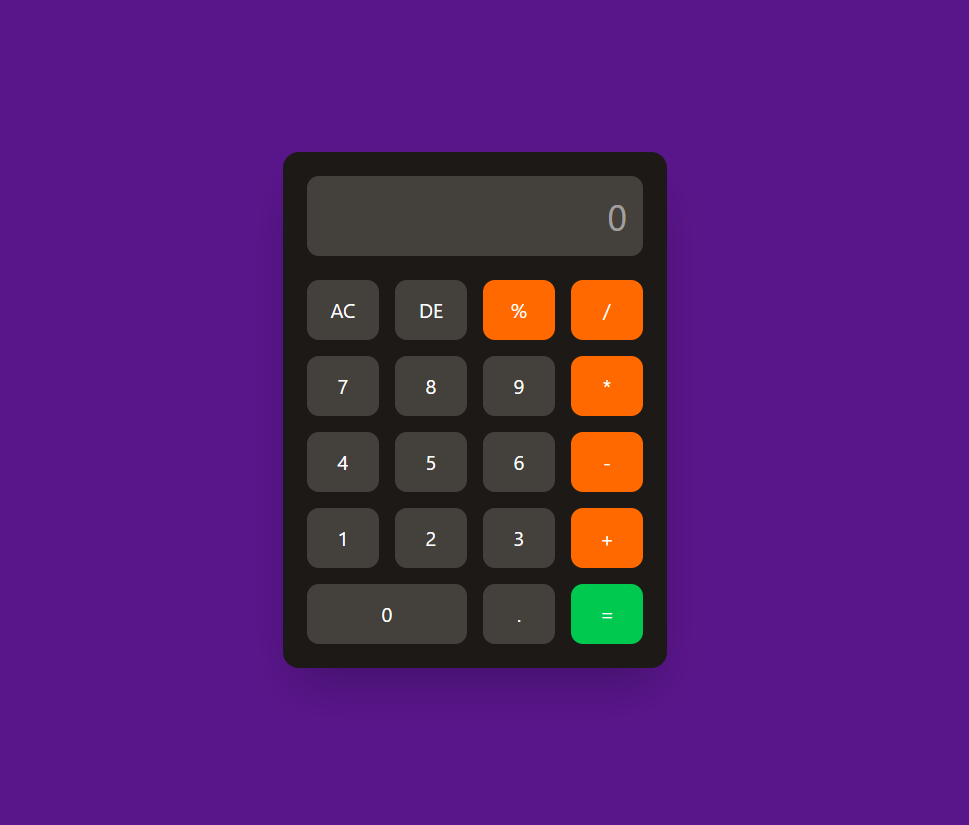

# 🧮 Calculator App

A sleek and responsive Calculator App built using HTML, Tailwind CSS, and Vanilla JavaScript.  
This calculator performs basic arithmetic operations with a clean modern UI and interactive button controls.

---

## 🚀 Live Demo

🔗 [https://achu19desg.github.io/calculator/](#)

---

## 🛠️ Technologies Used

- HTML5
- Tailwind CSS
- Vanilla JavaScript

---

## 📸 Screenshots

### 🖥️ Calculator Interface

---

